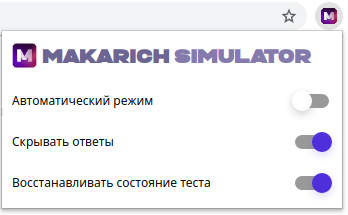

# MakarichSimulator


[](https://opensource.org/licenses/MIT)

MakarichSimulator - это расширение для браузера [Google Chrome](https://www.google.com/chrome/?hl=ru), предоставляющее пользователю удобный интерфейс для работы с образовательным порталом.

# Установка
Установка расширения в браузере Google Chrome (необходимо включить `Режим разработчика`):


Для конвертирования загружаемых файлов в pdf необходима программа [wkhtmltopdf](https://wkhtmltopdf.org/). Установка программы для Ubuntu:
```sh
$ sudo apt-get install wkhtmltopdf
```

# Использование 
## 1. Расширение
Расширение имеет `4 режима работы`. Настроить режимы можно через всплывающее меню:



### 1. Ручной режим (автоматический режим выключен)
На странице с вопросом появляется кнопка ``Save it``, по нажатию на которую происходит сохранение текущего вопроса и ответа в html файл и переход к следующему вопросу.

### 2. Автоматический режим
Происходит цикличное сохранение вопроса и переход к следующему с задержкой в 2 секунды. На странице с вопросом появляется кнопка ``Stop it``, по нажатию на которую данный процесс прерывается.

### 3. Режим 'Скрывать ответы'
На странице с вопросом блок с правильным ответом не будет отображаться. Также на странице появляется кнопка ``Show answer``, которая производит отображение / скрытие правильного ответа по нажатию на нее. 

### 4. Режим восстановление состояния теста **(test)**
Используется для прохода по базе вопросов до последнего сохраненного вопроса. Рекомендуется использовать данный режим только для случаев, когда порядок вопросов не изменяется. На странице с вопросом появляется кнопка ``Upload file``, по нажатию на которую открывается форма для загрузки html файла на сайт. Далее требуется загрузить файл с сохраненными вопросами, после чего запускается цикличный процесс прохода по вопросам с сравнением текущего вопроса и последнего сохраненного вопроса в файле.

## 2. Сценарий sh
Сценарий необходим для объединения загружаемых файлов в один общий. Также выполняется проверка загружаемых файлов на дублирование и последующее конвертирование выходного html файла в pdf формат.

Вызов сценария:
```sh
  <path>/src/union.sh <subject-name>
```
Сценарий объединения и конвертирования загружаемых файлов находится в файле:
```sh
  src/union.sh
```
По умолчанию файлы загружаются в папку 
``$HOME/Загрузки``. После объединения html файлы перемещаются в папку ``$HOME/Документы/Тесты/html``, а сконвертированные в pdf html-файлы в папку ``$HOME/Документы/Тесты/pdf``

Настройки списка предметов и папок также находятся в файле сценария:

