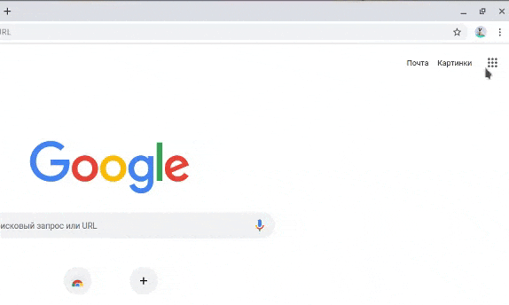
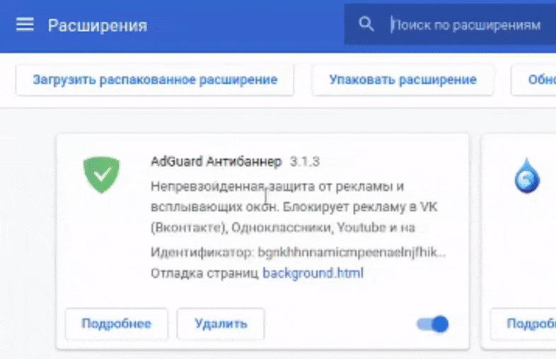
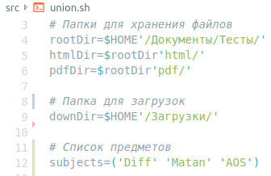

# MakarichSimulator


[](https://opensource.org/licenses/MIT)

MakarichSimulator - это расширение для браузера [Google Chrome](https://www.google.com/chrome/?hl=ru), предоставляющее пользователю удобный интерфейс для работы с образовательным порталом.

# Установка
Установка расширения в браузере Google Chrome (необходимо включить `Режим разработчика`):



Для конвертирования загружаемых файлов в pdf необходима программа [wkhtmltopdf](https://wkhtmltopdf.org/). Установка программы для Ubuntu:
```sh
$ sudo apt-get install wkhtmltopdf
```

# Использование 
Сценарий объединения и конвертирования загружаемых файлов находится в файле:
```sh
  src/union.sh
```
По умолчанию файлы загружаются в папку 
``$HOME/Загрузки``. После объединения html файлы перемещаются в папку ``$HOME/Документы/Тесты/html``, а сконвертированные в pdf html-файлы в папку ``$HOME/Документы/Тесты/pdf``

При запуске необходимо указать название название предмета. Настройки списка предметов и папок также находятся в файле сценария:

